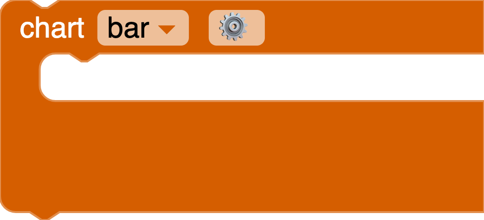

# Blocks

## Data sets

Loads a builtin dataset

Loads a CSV dataset from an external internal URL. If the URL is a Google Sheet, it will automatically be converted to CSV.

Open the block context menu, click 'Add Comment', paste CSV data.

## Cleanup

Fills missing data cells with the given value.

Removes the selected columns from the dataset

Removes rows with identical column values in the dataset.

Rename a columne

## Organize

Sorts the dataset based on the selected column and order.

Keeps the selected columns and drops the others

Selects the rows for which the condition evaluates true

Selects the rows for which the condition evaluates true

Select N rows from the sample, from the head, tail or a random sample.

## Compute

Adds a new column with the result of the computation.

Adds a new column with the result of the computation.

## Visualize

Renders the block data in a scatter plot

Renders the block data in a bar chart

Renders the block data in a bar chart

Renders the block data as a histogram

Displays the block data as a table

## Statistics

## Data variables

## Charts

Renders the block data in a line chart

Renders the block data in a 2D heatmap

Renders pairwize scatter plots

