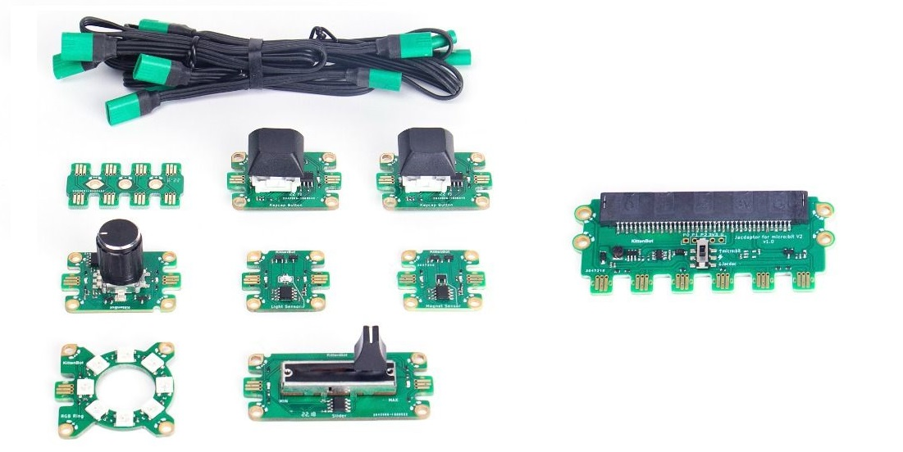
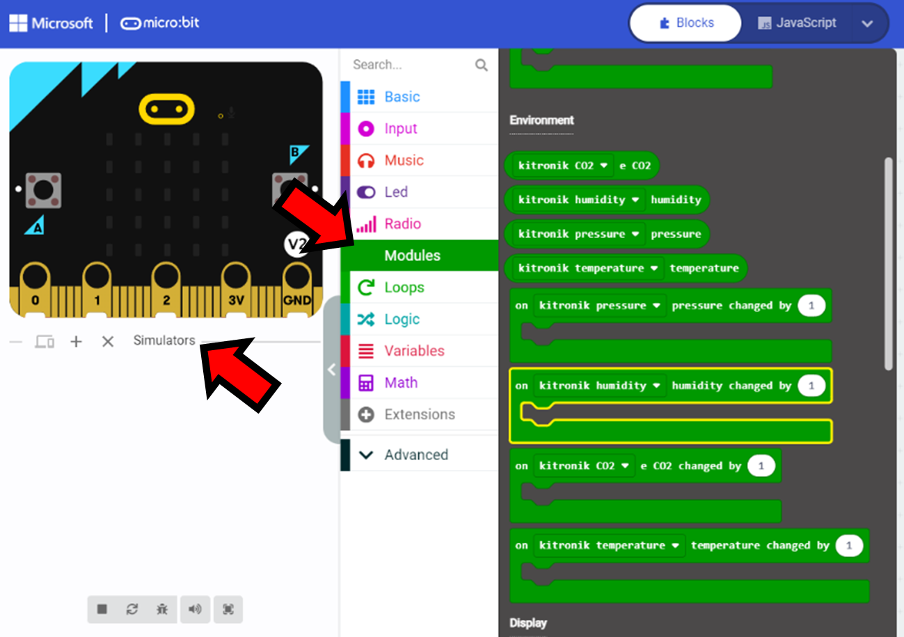
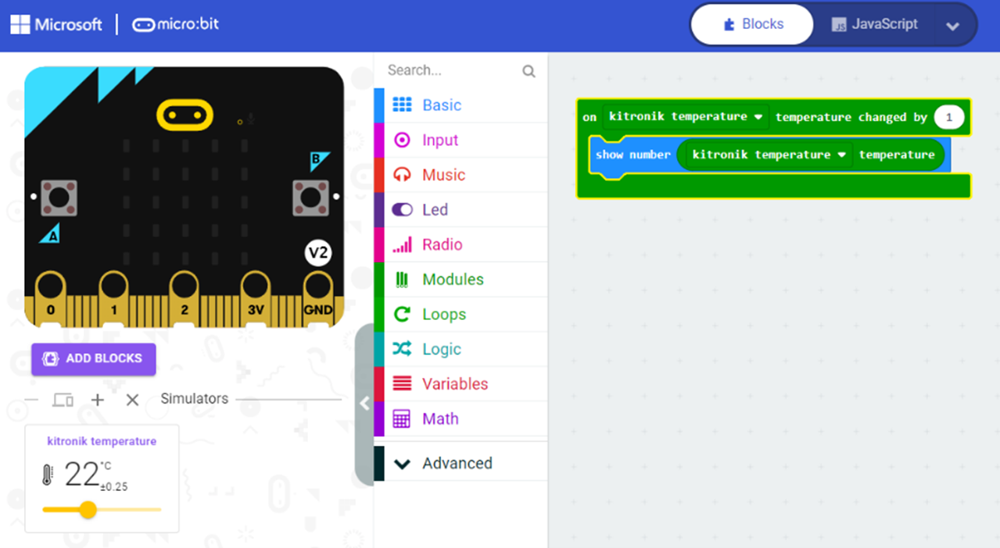

# Jacdac for MakeCode and the micro:bit

We are delighted to announce the public debut of Microsoft's [Jacdac](https://aka.ms/jacdac) platform  for plug-and-play creation and programming of physical computing systems.  Jacdac brings three exciting enhancements to [MakeCode for the micro:bit](/clients/makecode):

1.	[modular accessories](#modular-accesories) with plug-and-play cables – Jacdac kit available from Kittenbot, as shown above;
2.	[unified block coding](#unified-block-coding-for-accessories) for all accessories; 
3.	[hardware simulators and device twins](#hardware-simulation-and-device-twins) for all accessories.

Jacdac is [backward compatible with existing micro:bit accessories](#backward-compatible-with-existing-accessories), 
providing unified block coding and simulators. A micro:bit V2 is required for deployment to hardware, as Jacdac needs more resources than available on the original micro:bit. 

**MakeCode users**, [read more](#makecode-users-call-to-action) to learn about how to use Jacdac with MakeCode for the micro:bit!

**Micro:bit accessory manufacturers**, [read more](#manufacturers-call-to-action) to learn ways to incorporate Jacdac into your accessories. 

## Modular accesories

Jacdac is a hardware+software platform for the plug-and-play creation and programming of physical computing systems. A “brain”, in this case a micro:bit V2, executes the user’s program, while a set of modular accessories—or modules—provide additional capabilities. Jacdac software and hardware designs are [open source on GitHub](/github/); Jacdac has been integrated with [MakeCode for the micro:bit](/clients/makecode).

[Kittenbot](https:/www.kittenbot.cc) is making [Jacdac Starter Kit A with Jacdaptor for micro:bit V2](/devices/kittenbot/jacdacstarterkitawithjacdaptorformicrobitv2v10/), shown at the beginning of the blog, available for purchase this summer in limited quantity. This first commercially-available kit features seven Jacdac modules: an RGB ring, a rotary button, two keycap buttons, a slider, a light sensor, and a magnet sensor. It also includes five Jacdac cables and a Jacdac hub.  Kittenbot’s Jacdaptor for the micro:bit V2 has six Jacdac edge connectors that can be used to connect to Jacdac modules via the Jacdac cables. The micro:bit plugs into the top of the Jacdaptor, while Jacdac cables are connected to the bottom.  The switch in the middle of the Jacdaptor controls the flow of power.

The video below shows a small system connecting the micro:bit V2 a keycap button and slider module via a Jacdaptor and two short Jacdac cables (cables come in three lengths).

<Video
    label="Starting simulators in the device dashboard"
    src="dashboard-simulators"
/>

Note that Jacdac users will need to supply their own micro:bit V2. The Kittenbot products do not include a micro:bit; Jacdac hardware and software do not work with micro:bit V1.

## Unified block coding for accessories

Jacdac provides a large set of [services](/services) to describe the high-level functionality of hardware, both existing micro:bit accessories and new Jacdac modules.  The [button service](/services/button), which represents any push button, is one of the simplest Jacdac services. The [LED service](/services/led) represents a small display of individually controlled RGB LEDs. Services enable programming against any Jacdac module, or other hardware, that supports the services, regardless of the manufacturer, with standardized programming blocks. This provides MakeCode users with consistent programming experience across a wide range of hardware accessories. 

The video below shows blocks associated with the button and LED services, as well as a simple program that sets all the LEDs blue when a button down event is received, and turns the LEDs off when a button up event is received. Note that the program continues to function when the keycap button is replaced by a rotary button, as both modules support the button service.  

## Hardware simulation and device twins

From the beginning, a web-based micro:bit simulator has been an essential part of the discovery process for the BBC micro:bit. With MakeCode for the micro:bit, you can create micro:bit programs and test them against the micro:bit simulator in the web browser before deploying programs to hardware; unfortunately, simulation is not available for most micro:bit accessories. 

For almost every service, Jacdac provides a simulator that integrates seamlessly into MakeCode, as well as a “device twin” that displays the status of a connected accessory.  The simulators let you program against Jacdac services without needing the hardware.

The next section shows the use of simulators for hardware-free programming against Jacdac services.

<Video
    label="Programming a button in MakeCode"
    src="blog-makecode-happy-button"
/>

## Backward compatible with existing accessories

Jacdac has been designed so that it can be used with existing micro:bit accessories. For example, the [Kitronik Air Quality and Environmental Board for micro:bit](https://kitronik.co.uk/products/5674-kitronik-air-quality-board-for-bbc-micro-bit) can be described by six Jacdac services that cover the set of sensors/features of the board: [temperature](/services/temperature), [air pressure](/services/airpressure), [humidity](/services/humidity), [equivalent CO₂](/services/eco2), [real time clock](/services/realtimeclock) and [character screen](/services/characterscreen). 

We have created [Jacdac samples of extensions](/ddk/microbit/extension-samples/) for a variety of micro:bit accessories. [Click here](https://makecode.microbit.org/beta#pub:github:pelikhan/pxt-kitronik-air-quality/jacdac) to load the Jacdac extension for the Kitronik board into MakeCode. 

As shown above, you’ll see a new category in the toolbar category (Modules) as well as a new pane (Simulators) under the micro:bit simulator (see two red arrows).  The Modules category contains the programming blocks for the six services associated with the Kitronik board. 

Using the “changed by” event handler for temperature (shown at the bottom of the Modules category), we create a simple program, as shown in the screen snapshot below, that reacts to a change in temperature measured by the Kitronik board. We tell MakeCode to spin up a Jacdac simulator for the program, which allows us to set the temperature and see the program react, displaying the current temperature on the micro:bit screen. 

Such a scenario simply wasn’t possible in MakeCode before Jacdac; as with the micro:bit simulator, you now can explore the hardware features of micro:bit accessories without needing the hardware itself!

## MakeCode users: call to action!

To get started with Jacdac for MakeCode and the micro:bit, users have several options:
-	**Jacdac kits available**: see the [device catalog](/devices)!
-	**Software for existing accessories**. Try out a micro:bit accessory with a [Jacdac MakeCode extension](/ddk/microbit/extension-samples).
-	**Jacdac hardware simulators**. Try out [Jacdac Projects for MakeCode](/clients/makecode/projects) right away, using Jacdac simulators.
If you have questions, please see the [Jacdac FAQ](/faq) and/or visit the [MakeCode forum](https://forum.makecode.com/c/jacdac/59).

## Manufacturers: call to action!

Jacdac provides manufactures of micro:bit accessories [several options](/ddk/microbit):
- **Software for existing accessories**. We have created a way to add Jacdac support to MakeCode extensions for existing accessories.  We have added Jacdac to several MakeCode extensions as [samples]((/ddk/microbit/extension-samples).  [Read more](/ddk/microbit/software-only-accessory/) about software-only Jacdac.
- **Add a Jacdac edge connector to your designs**. It’s inexpensive to add the 3-wire [Jacdac edge connector](/ddk/microbit/#low-powered-physical-connector) to your accessory.	
- **Make your own Jacdac modules** using the Jacdac [Device Development Kit](/ddk).

If you have questions, please start a discussion at https://github.com/microsoft/jacdac/discussions; if you have an issue with Jacdac, please file an issue at https://github.com/microsoft/jacdac/issues. For issues around your own extension, please file an issue there and notify us at jacdac-tap@microsoft.com.  
