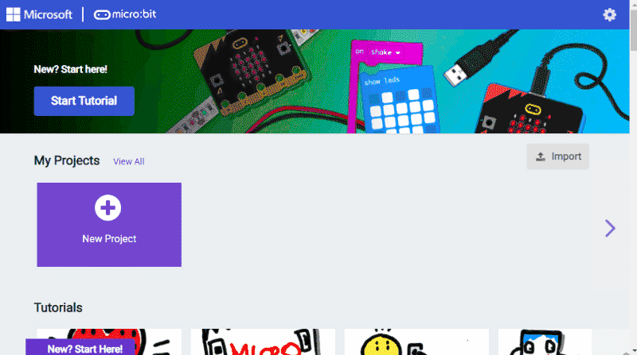
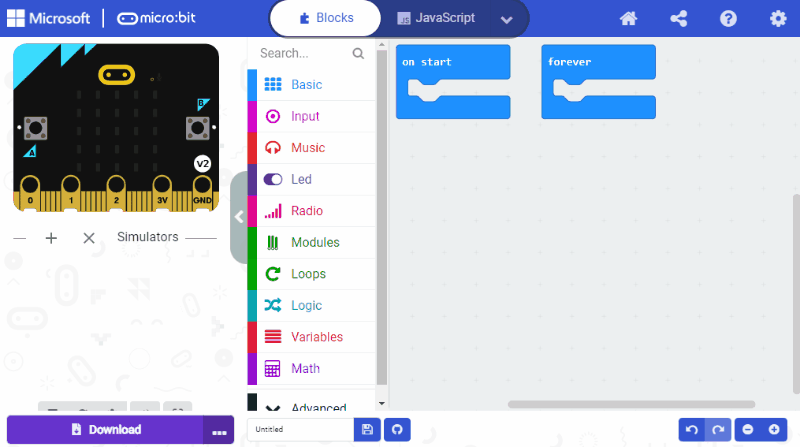
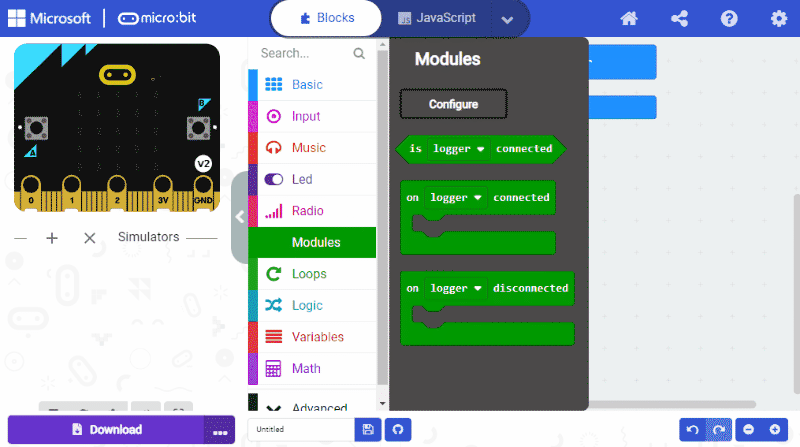

# MakeCode Extensions

The [pxt-jacdac](https://github.com/microsoft/pxt-jacdac) extension contains MakeCode support for many Jacdac services. Each Jacdac service is represented by a separate MakeCode extension within the **pxt-jacdac** repo; MakeCode knows which services a Jacdac module (physical or simulated) supports to help you get started quickly.

## Getting started

-   Open [MakeCode for micro:bit](https://makecode.microbit.org/), [Arcade](https://arcade.makecode.com/) or [Maker](https://maker.makecode.com/)
-   Open or create a new project.
-   Add the **Jacdac** extension.
-   You should see a **Modules** drawer in the toolbox, under **Advanced**.

### Connecting to a micro:bit V2

In the micro:bit editor, you can connect your micro:bit V2 and the editor will automatically communicate with the physical Jacdac modules.

-   Click on the menu of the **Download** button and select **Connect Device** and follow the instructions.
-   Download your program at least once, even if it's empty, so that you get the latest Jacdac runtime in the micro:bit.

### Adding blocks for services

-   After connecting, plug **one or more** modules to the micro:bit. You should see them appear in the **Devices** section.
-   Click on **Add Blocks** to add the extensions for these modules' services in your project.
-   Open the **Modules** drawer in you will find the blocks for your service.

** Pro tip: you need to repeat this procedure if you use other module types! **

-   If you do not have the physical module, you can also start a simulator. For example, **start a button**.
-   Click on **Add Blocks** and follow the same procedure as for physical modules.

Great you've got your first Jacdac program running on the micro:bit!

## What's next?

-   [User guide](/clients/makecode/user-guide/)
-   [Projects](/clients/makecode/projects/)
-   [Extensions](/clients/makecode/extensions/)
-   [Servers](/clients/makecode/servers/)
