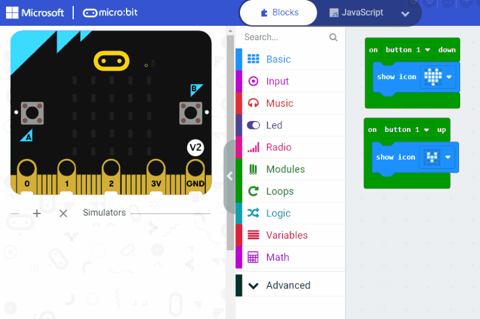

# MakeCode Clients

The [pxt-jacdac](https://github.com/microsoft/pxt-jacdac) extension contains MakeCode support many Jacdac services.

## Getting started

-   Open [MakeCode for micro:bit](https://makecode.microbit.org/), [Arcade](https://arcade.makecode.com/) or [Maker](https://maker.makecode.com/)
-   Open or create a new project.
-   Add the **Jacdac** extension.
-   You should see a **Modules** drawer in the toolbox, under **Advanced**.

## Connecting to a micro:bit V2

In the micro:bit editor, you can connect your micro:bit V2 and the editor will automatically communicate with the physical Jacdac modules.

- Click on the menu of the **Download** button and select **Connect Device** and follow the instructions.
- Download your program at least once, even if it's empty, so that you get the latest Jacdac runtime in the micro:bit.

## Adding blocks for services

-   After connecting, plug **one or more** modules to the micro:bit. You should see them appear in the **Devices** section.
-   Click on **Add Blocks** to add the blocks for these modules in your project.
-   Open the **Modules** drawer in you will find the blocks for your service.

** Pro tip: you need to repeat this procedure if you use other module types! **

-   If you do not have the physical module, you can also start a simulator. For example, **start a button**.
-   Click on **Add Blocks** and follow the same procedure as physical modules.

## Hello Jacdac Heart beat

Start a button simulator and add the blocks below to your project. Jacdac should automatically "bind" your simulated button
to `button1` and respond to `up`/`down` events by showing icons on the screen.

## Mixing simulator and physical modules

You can use a mix of simulators or physical services to work on your code.

In this example, we remove the button simulator and connect a physical keyboard cap module which implements the button service.
Automatically, the Micro:bit simulator connects to the physical button and uses it in the code.

## "Only one brain"

To avoid having the micro:bit simulator **and** the physical micro:bit running code **at the same time**,
Jacdac automatically puts one of the two micro:bit in a **proxy mode** when restarting the simulator or downloading code into the physical device.
In proxy mode, the Jacdac messages are transmitted by the MakeCode code is not executed

- in proxy mode, the micro:bit renders a proxy icon.

-   when a physical micro:bit restarts, the simulator micro:bit enters proxy mode.
-   when the simulator micro:bit restarts, the physical micro:bit enters proxy mode.
-   in proxy mode, the physical micro:bit still transmits the Jacdac packets, so you can see physical services, but does not execute MakeCode code.

## Servers

It is also possible to spin some [server services](/clients/makecode/servers/) using MakeCode.

## Open Source

The sources of the MakeCode clients are in GitHub at https://github.com/microsoft/pxt-jacdac.
