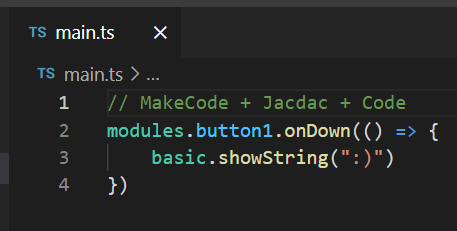

# MakeCode in Visual Studio Code

This guide is for developers wanting to edit MakeCode programs in their usual text-based code editor,
in particular Visual Studio Code (Code).

MakeCode program can be authored in **Static TypeScript**,
a subset of TypeScript suitable for micro-controllers.
Those programs can be authored and compiled with excellent tooling support in Visual Studio Code.



## Setup

-   install [Code](https://code.visualstudio.com/)
-   install [Node.JS](https://nodejs.org/en/download/)
-   install the [MKC](https://github.com/microsoft/pxt-mkc), the MakeCode command line tool

```
npm install -g makecode
```

## New project

-   create a new folder and open Code in it
-   open a new terminal in code (Ctrl + ``)
-   use the makecode cli to initialize the project for the microbit + Jacdac

```
mkc init microbit jacdac
```

## Adding dependencies

Based on which service you plan to use, add the corresponding MakeCode extensions using `mkc add`.

```
mkc add jacdac-button jacdac-led
```

## Building

-   launch mkc in watch mode

```
mkc build --watch
```

-   open `main.ts` in Code and start editing. mkc will automatically rebuild your changes when a change is detected.

## Building and deploying

-   launch mkc in watch mode (`-w`) and auto-deploy (`-d`)

```
mkc build --watch --deploy
```
