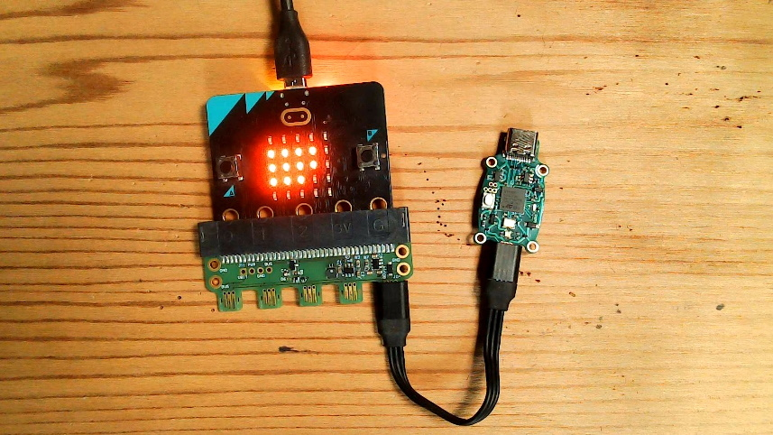

# HID Mouse

The HID mouse extension can be used to control a HID mouse, via a Jacdac module
that implements HID (generally communicating to a desktop/laptop over USB). Use the
[JM Brain F4 v0.2](/devices/microsoft-research/jmbrainf441v02) or [JM Brain RP2040 v0.1](/devices/microsoft-research/jmbrainrp204059v01) module,
loaded with the HID Keyboard + Mouse firmware that is available via the same links.

## Mouse buttons

The state of one or more buttons can be modified using the `setButton` method:

```blocks
input.onButtonPressed(Button.A, function() {
    modules.hidMouse1.setButton(jacdac.HidMouseButton.Left, jacdac.HidMouseButtonEvent.Click)
})
```

## Mouse motion

The mouse can be moved (by a number of pixels in the `x` and `y` dimensions)
using the `move` method:

```blocks
input.onButtonPressed(Button.B, function() {
    modules.hidMouse1.move(10, 10)
})
```

A third optional parameter (`time`, defaults to 0) to the `move` method specifies
how long the move should take (in milliseconds).

## Mouse wheel

The mouse wheel can be turned up or down using the `wheel` method,
where the first parameter (`dy`) is positive if scrolling up and negative if scrolling down.
The second parameter (`time`) specifies how long the operation should take (in milliseconds):

```blocks
input.onButtonPressed(Button.AB, function() {
    modules.hidMouse1.wheel(10, 0)
})
```

## Connecting the Mouse module

The module that implements the HID mouse server (like the [JD BRAIN F4](/devices/microsoft-research/jmbrainf441v02) below)
must also be connected with a USB-C cable to your computer.



<MakeCodeExtensionFooter serviceName="hidmouse" />