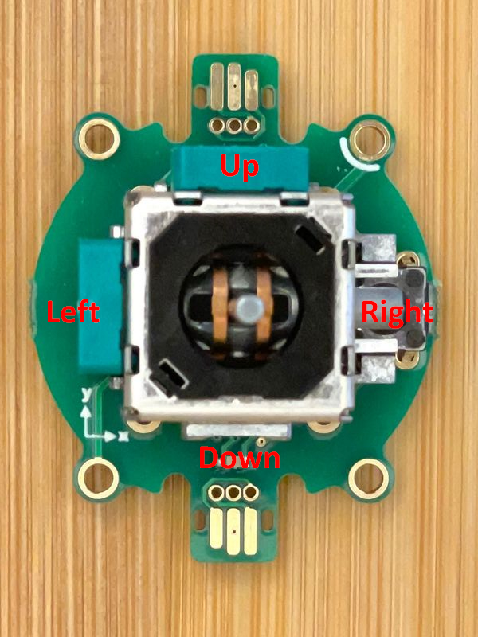

# Joystick

The joystick extension supports a two axis directional joystick
via methods `x` and `y` that return values in the range  -100.0 to +100.0.
Events are generated by various motions of the joystick, as well 
as optional buttons that may be associated with the joystick.

## Coordinates

```blocks
basic.forever(() => {
    plot(modules.joystick1.x(), modules.joystick1.y())
})

function plot(x: number, y: number) {
        basic.clearScreen();
        let dispX = 2;
        let dispY = 2;
        if (x < -30)
            dispX--;
        if (x < -60)
            dispX--;
        if (x > 30)
            dispX++;
        if (x > 60)
            dispX++;
        if (y < -30)
            dispY--;
        if (y < -60)
            dispY--;
        if (y > 30)
            dispY++;
        if (y > 60)
            dispY++;
        led.plot(dispX, dispY);
}

```

## Events

```blocks
modules.joystick1.onButtonsChanged(function () {
    if (modules.joystick1.isButtonDown(jacdac.JoystickButtons.Left)) {
        led.stopAnimation()
        basic.showArrow(ArrowNames.West)
    } else if (modules.joystick1.isButtonDown(jacdac.JoystickButtons.Right)) {
        led.stopAnimation()
        basic.showArrow(ArrowNames.East)
    } else if (modules.joystick1.isButtonDown(jacdac.JoystickButtons.Up)) {
        led.stopAnimation()
        basic.showArrow(ArrowNames.North)
    } else if (modules.joystick1.isButtonDown(jacdac.JoystickButtons.Down)) {
        led.stopAnimation()
        basic.showArrow(ArrowNames.South)
    }
})
```

# JM Analog Joystick v0.2

The [JM Analog Joystick v0.2](/devices/microsoft/research/jmanalogjoystick44v02) module has a silkscreen
with the X and Y axes, as shown in the picture below (annotated with the Left, Right, Up, and Down 
directions, corresponding to the events mentioned
previously):




## See Also

- [service specification](/services/joystick/)
