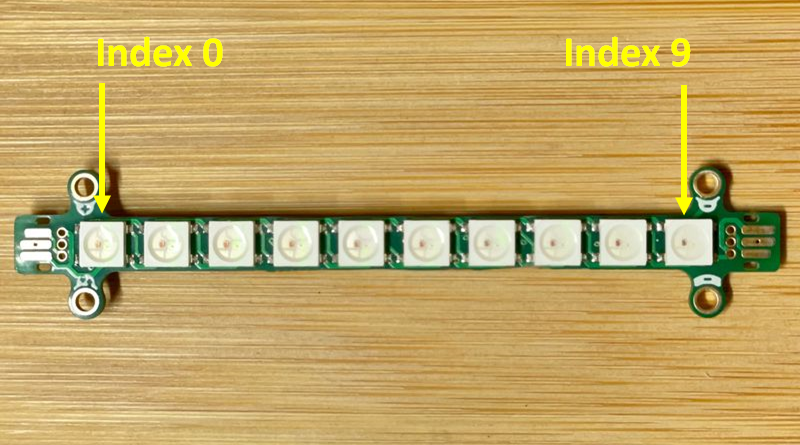
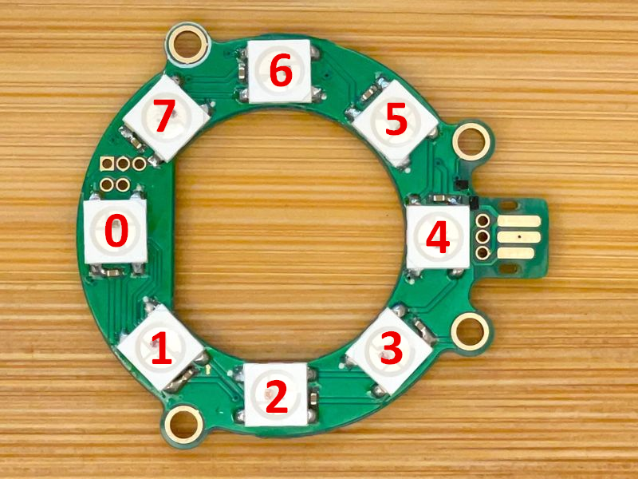

# LED Pixel

The LED pixel extension provides methods for working with
an strip of RGB LEDs, as well as a built-in set of animations.

# Direct control of pixels

All the pixels on a strip can be set to a color using the `setAll` method:

```blocks
input.onButtonPressed(Button.A, () => {
    modules.ledPixel1.setAll(0x00ff00)
})
input.onButtonPressed(Button.B, () => {
    modules.ledPixel1.setAll(0xff0000)
})
```

The brightness of the strip can be set and retrieved as follows:

```blocks
input.onButtonPressed(Button.A, () => {
    modules.ledPixel1.setBrightness(85)
    let brightness = modules.ledPixel1.brightness()
    basic.showNumber(brightness)
})
```

Pixels can be individually set using the `setPixel` method as shown in the
example below, which also uses the `numPixels` method to get the number
of pixels supported by the underlying hardware.

```blocks
input.onButtonPressed(Button.A, () => {
    modules.ledPixel1.setAll(0)
    let n = modules.ledPixel1.numPixels()
    for(let i = 0; i <= n - 1; i++) {
        modules.ledPixel1.setPixel(i, 0x00ff00)
        basic.pause(200)
    }
})
```

## Built-in Animations

The MakeCode extension provides support for a set of animations
that can be triggered via the `showAnimation` method:
```blocks
input.onButtonPressed(Button.A, () => {
    modules.ledPixel1.showAnimation(modules.ledPixelAnimations.sparkle, 2000)
})
input.onButtonPressed(Button.B, () => {
    modules.ledPixel1.showAnimation(modules.ledPixelAnimations.firefly, 2000)
})
```

## Commands

The [LED pixel service](/services/ledpixel) has
a small command language that can be used to create your own animations
and effects.

```
function runEncoded(prog: string, args?: number[]) {
    let encoded = jacdac.lightEncode(prog, args)
    modules.ledPixel1.runProgram(encoded)
}

input.onButtonPressed(Button.A, () => {
     runEncoded("rotfwd 1")
     modules.ledPixel1.setPixel(0, 0x00ff00)
})
```

## JM RGB LED Bar v0.1

The [JM RGB LED Bar v0.1](/devices/microsoft/research/jmrgbledbar58v01) module
has one end labelled with a "+" sign. The LED RGB at this end is at index
0 (left end of bar in picture below).  
The LED RGB at the other end of the bar (labelled with "-") is at index 9
(right end of bar in picture below).



## JM RGB LED Ring v2.1

The [JM RGB LED Ring v2.1](/devices/microsoft/research/jmrgbledring37v21) module
has eight LEDs. The LED opposite from the edge connector is at index 0 and
indices increase counter-clockwise, as shown below:



## See Also

- [service specification](/services/ledpixel/)
