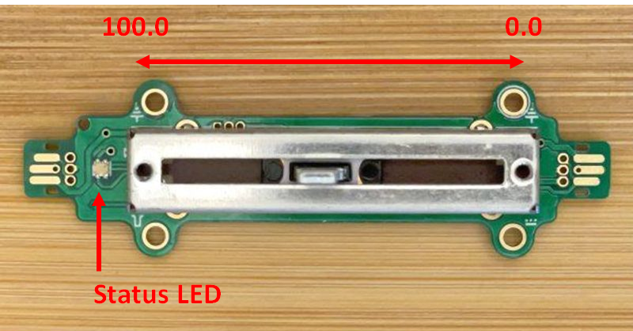

# Potentiometer

The potentiometer extension reports position as a floating
point value between 0.0 and 100.0.
The `position` method returns the current position of the potentiometer.

The following program outputs the position whenever the position changes by
5:

```blocks
modules.potentiometer1.onPositionChangedBy(5, function() {
    led.plotBarGraph(modules.potentiometer1.position(), 100)
})
```

## JM Slider v1.1

The [JM Slider v1.1](/devices/microsoft/research/jmslider49v11) module implements
the potentiometer service. The status LED end of the slider should yield
100.0 (or close to it), while the other end of the slider should yield 0.0



## See Also

-   [service specification](/services/potentiometer/)
