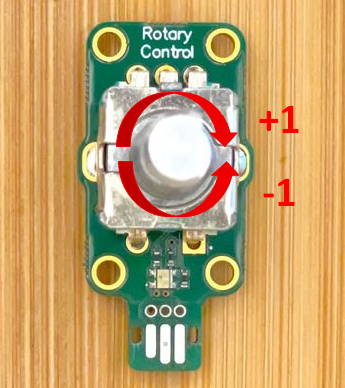

# Rotary Encoder

The rotary encoder extension reports the position of an incremental
rotary encoder in number of clicks from the initial position (0),
where clockwise motion increases the position and counter-clockwise
motion decreases the position.
The `position` method returns the current position.

The program below outputs the current position whenever it changes by one click:

```blocks
modules.rotaryEncoder1.onPositionChanged(() => {
    led.stopAnimation()
    basic.showNumber(modules.rotaryEncoder1.position())
})
```

# JM Rotary Control + Button v1.0

The [JM Rotary Control + Button v1.0](/devices/microsoft-research/jmrotarycontrolbuttonv10) module
is shown in the picture below (annotated with clockwise and counter-clockwise directions). Note that
the initial position is set 0 when the device starts or is reset, regardless of the physical position
of the shaft of the rotary encoder:



## See Also

-   [service specification](/services/rotaryencoder/)
