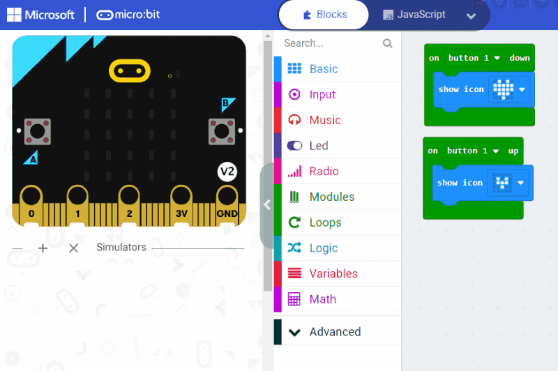

# Heart Beat

Start a button simulator and add the blocks below to your project. Jacdac should automatically "bind" your simulated button
to `button1` and respond to `up`/`down` events by showing icons on the screen.



```blocks
modules.button1.onUp(function () {
    basic.showIcon(IconNames.SmallHeart)
})
modules.button1.onDown(function () {
    basic.showIcon(IconNames.Heart)
})
```

