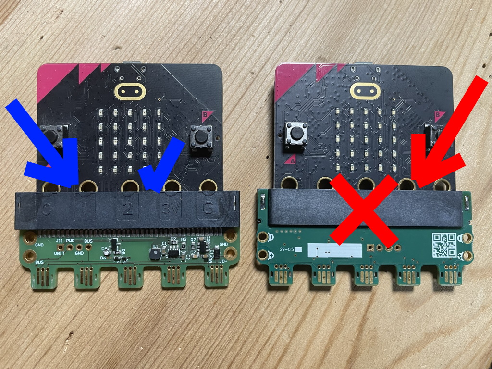
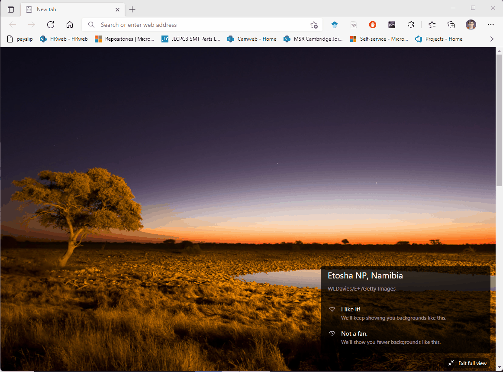
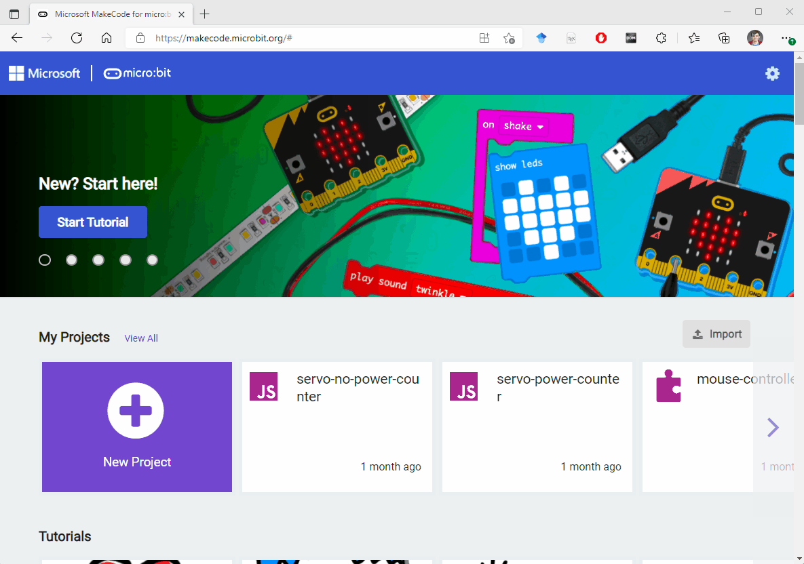
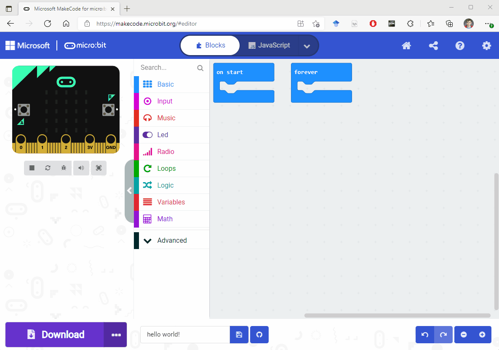
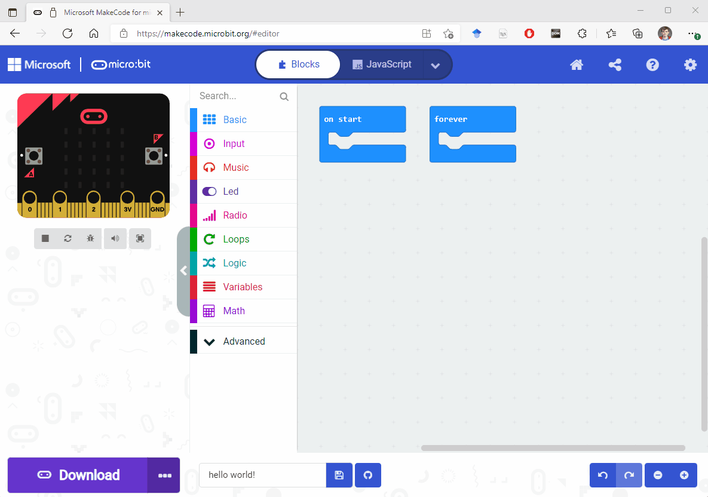
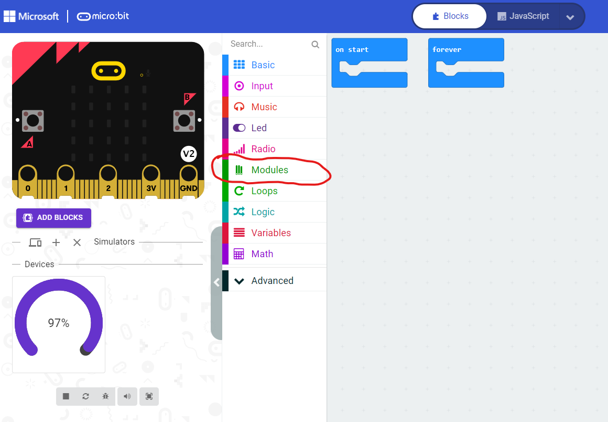
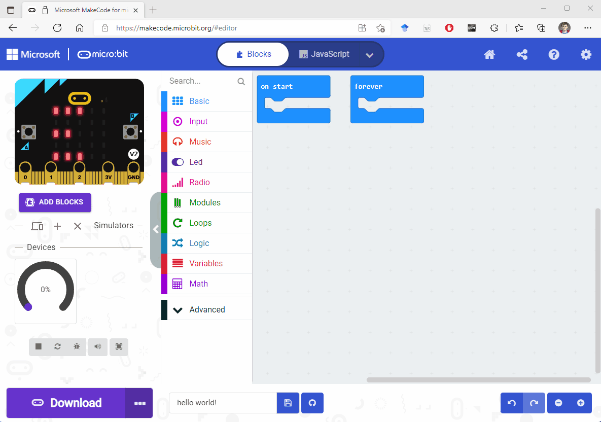
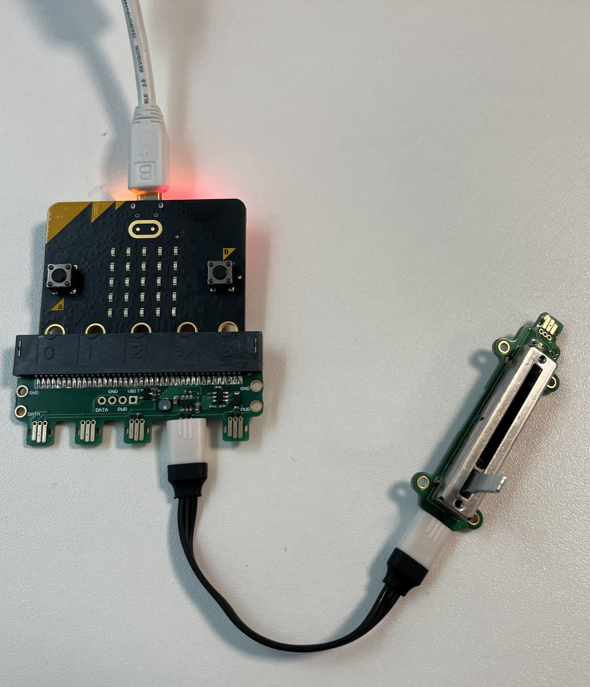
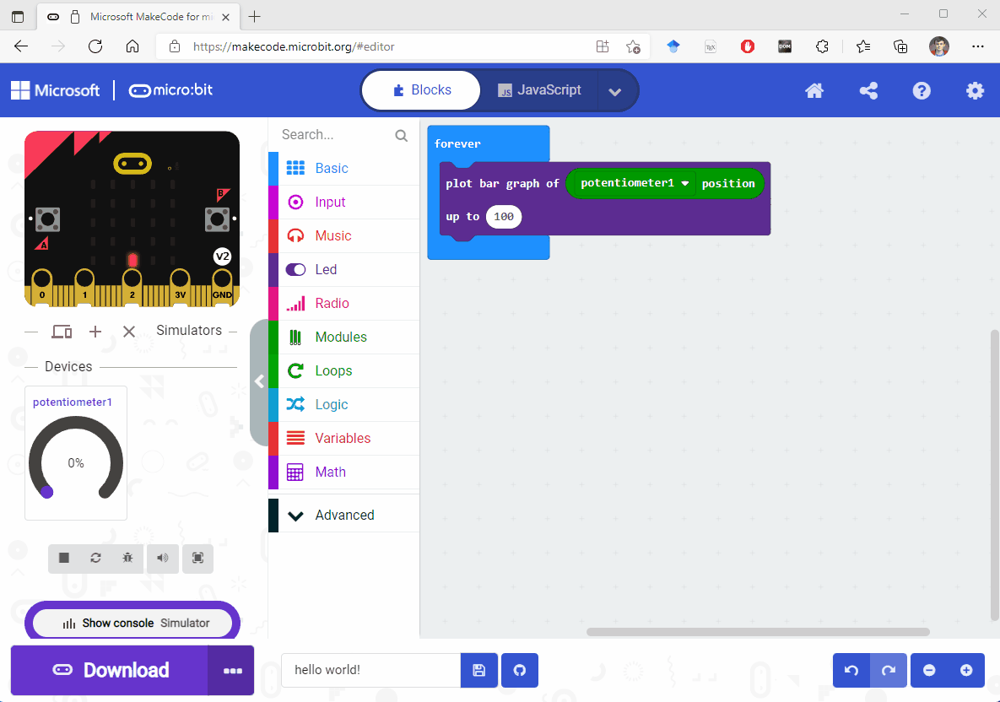

## Before you code...

The **[Out of the box program](/overview/kit/oob/)** is a Jacdac program
that automatically reacts to Jacdac modules connected to the micro:bit v2. The micro:bit you were sent should already be loaded with this program.
Before getting into coding Jacdac programs, try plugging Jacdac modules into your micro:bit and see what happens!


**!!Heads up!!** make sure that you connect the Jacdapter with the edge connector labels (0, 1, 2, 3V, G) facing you!



## Let's get coding

Before starting these steps, please make sure your **micro:bit V2** is connected to your computer using a USB cable. Please also ensure your micro:bit is running [the out of box firmware](/overview/kit/oob/) it came with!

### 1. Open [MakeCode for micro:bit](https://makecode.microbit.org/)



### 2. Create a new project



### 3. Connect MakeCode to your micro:bit



### 4. Add the Jacdac extension to MakeCode

After completing this step, you should see digital twins of any modules you have connected to your micro:bit in MakeCode!



## Coding with Jacdac modules

After following the steps above, you should now have a green modules category in the MakeCode Blocks toolbox:



However, if you expand the "Modules" blocks category, you will not find any blocks for the modules you have connected to your micro:bit. This is because one extra step is required.

To add the blocks for the modules you have connected click the "add blocks" button:



Now you know the steps to build a program with Jacdac modules! Hooray!

## Task one

This task is a step by step guide to plot the value of the slider module using the micro:bit's display!

The hardware required for this task is:

-   a micro:bit V2
-   a USB cable connecting the micro:bit V2 to your computer
-   a micro:bit V2 Jacdac adapter
-   a Jacdac slider module
-   a Jacdac cable to connect the slider module to the micro:bit Jacdapter

Here's a picture of what the set up should look like:



### Step 1

Please create a new makecode project, and follow the steps above to add Jacdac to your project. (If you've just created a new project using the steps above, there is no need to repeat the steps)

### Step 2

If you've not already connected your Jacdac slider, connect it to your micro:bit.

With the slider connected, check it has appeared in the MakeCode editor and click "Add blocks"


### Step 3

Grab the `on potentiometer1 position changed by 5` from the modules block category. Then, take a `plot bar graph` block from the "Led" category and place it inside the `on potentiometer1 position changed by 5` block.

```blocks
modules.potentiometer1.onPositionChangedBy(5, function () {
    led.plotBarGraph(
    0,
    0
    )
})
```

### Step 4

From the modules category, grab the "potentiometer1 position" and place it on the first "0" of the "plot bar graph" block:

```blocks
modules.potentiometer1.onPositionChangedBy(5, function () {
    led.plotBarGraph(
    modules.potentiometer1.position(),
    0
    )
})
```

### Step 5

Slider values range from 0-100. So, lets change the `up to` portion of the plot bar graph block to 100:

```blocks
modules.potentiometer1.onPositionChangedBy(5, function () {
    led.plotBarGraph(
    modules.potentiometer1.position(),
    100
    )
})
```

### Step 6

That's it! Now, when you move the position of your physical slider, you will see a poportional change to the number of Leds displayed on the micro:bit simulators' display.



### (optional) Step 7

Just like any MakeCode program, you can click the download button to see the same program running on your physical micro:bit! When the program is downloaded, the physical slider will change the number of Leds displayed on the physical micro:bit's display.

## Task 2

This next task will be less structured and will require the slider module and the 10-RGB LED bar module. Please connect these two modules to the micro:bit Jacdapter.

Now, with those modules connected, create a program that: when the slider value changes, the colour of the RGB LED bar module changes.

### Hints

-   You can use sensor values in the setall command, not just colours:

```blocks
modules.ledStrip1.setAll(input.acceleration(Dimension.X))
```

-   You might want to transform the slider value somehow to get more interesting colours. Look in the "math" category for the map block!

## Troubleshooting

### Help my micro:bit is display a frowny face followed by a number!

That's ok, please press reset on the back of the micro:bit.

### Help, none of my Jacdac modules are appearing in the browser!

If this happens, the first thing to try is to refresh the MakeCode editor. If this does not work, follow the connection steps listed above. If this again does not work, please ensure the program you are running on the micro:bit has the Jacdac extension added to it!

## What's next?

-   [User guide](/clients/makecode/user-guide/)
-   [Extensions](/clients/makecode/extensions/)
-   [Projects](/clients/makecode/projects/)

## Advanced

-   [Editing in Visual Studio Code](/clients/makecode/code/)
-   [Servers](/clients/makecode/servers/)
