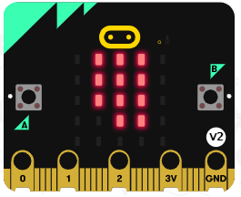
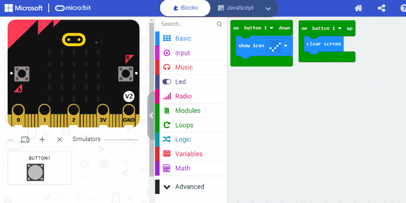
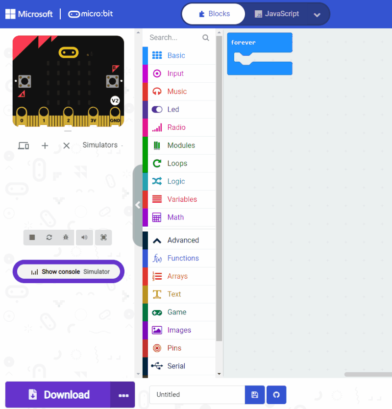

# User guide

## Mixing simulator and physical modules

You can use a mix of simulators or physical services to work on your code.

In this example, we remove the button simulator and connect a physical keyboard cap module which implements the button service.
Automatically, the Micro:bit simulator connects to the physical button and uses it in the code.


## Proxy mode: "Only one brain"

To avoid having the micro:bit simulator **and** the physical micro:bit running code **at the same time**,
Jacdac automatically puts one of the two micro:bit in a **proxy mode** when restarting the simulator or downloading code into the physical device.
In proxy mode, the Jacdac messages are transmitted by the MakeCode code is not executed

-   in proxy mode, the micro:bit renders a proxy icon
- to exit proxy mode, **reset the device** - either the simulator or the physical device



-   when a physical micro:bit restarts, the simulator micro:bit enters proxy mode.
-   when the simulator micro:bit restarts, the physical micro:bit enters proxy mode.
-   in proxy mode, the physical micro:bit still transmits the Jacdac packets, so you can see physical services, but does not execute MakeCode code.


## Multiple Roles

When running your code, Jacdac binds the modules detected on the bus with the **roles** defined in your program.
Each service comes with a default role which is typically what you start with. For example `button1` is the default role for buttons.

```blocks
modules.button1.onUp(function () {
    basic.showIcon(IconNames.SmallHeart)
})
```

However, if you want to create a program with multiple buttons, you would need to define additional roles in your program.

### Blocks editor

-   Open the **Modules** drawer
-   Click **Settings** to open the roles editor
-   Add and remove roles and go back

Once reloaded, you should be able to select your roles in the block drop downs.



### JavaScript editor

Unfortunately, the role editor is not yet available in the JavaScript view. So you are left with 2 choices, go to blocks, add roles, go back to JavaScript. 
Or... add them manually by instantiating clients.

```
export const dotMatrix2 = new modules.DotMatrixClient("dot Matrix2")
```

## Role lifecycle

Each role, like `button1` defined in the MakeCode program needs to be bound to a server (module) before it starts to operate.
When the micro:bit starts or when a new module is plugged, it may take a couple seconds before roles around bound (there is some time needed to discover modules on the bus).
This means that typically roles are not yet bound when running the `on start` block.

Instead of using `on start`, you can use `on connected` and `on disconnected`
to start or stop using a role.

```blocks
modules.button1.onDisconnected(function () {
    basic.showIcon(IconNames.No)
})
modules.button1.onConnected(function () {
    basic.showIcon(IconNames.Heart)
})
```


## Updating Jacdac Extensions

Sometimes, you may have to update the Jacdac extension used in your project. This happens when we fix a bug or add a new feature!

-   switch to Javascript using the language button
-   expand the **Explorer** tree view
-   click on the update icon next to the jacdac extension entry
-   That's it!

