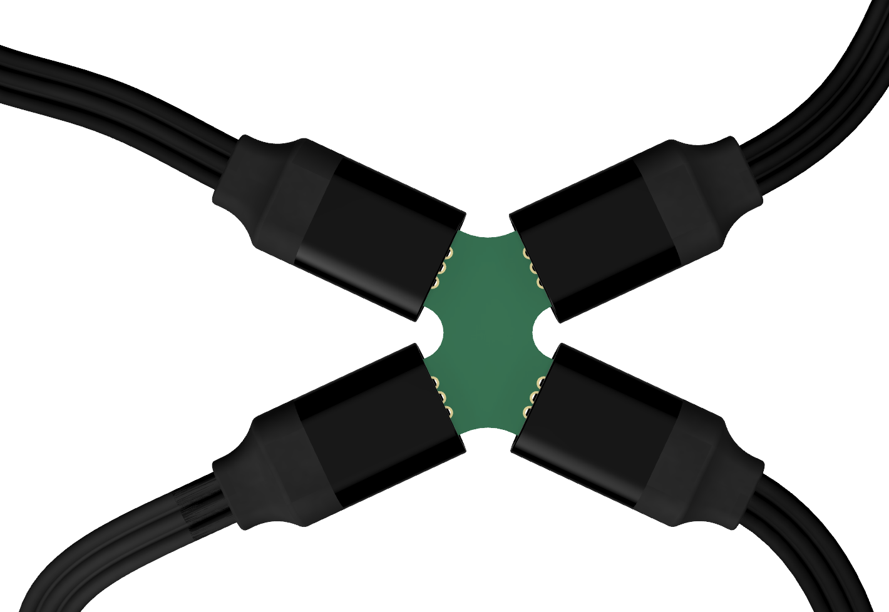
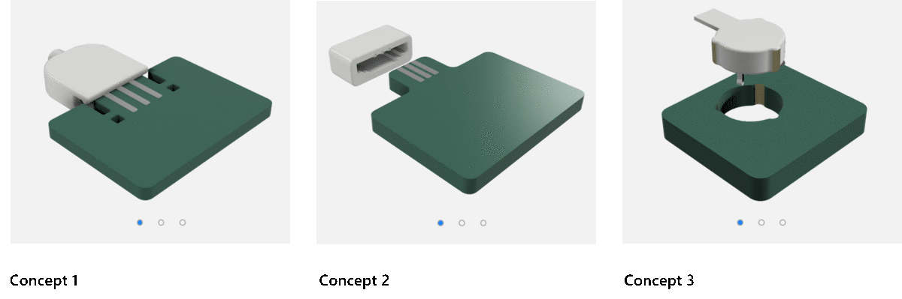
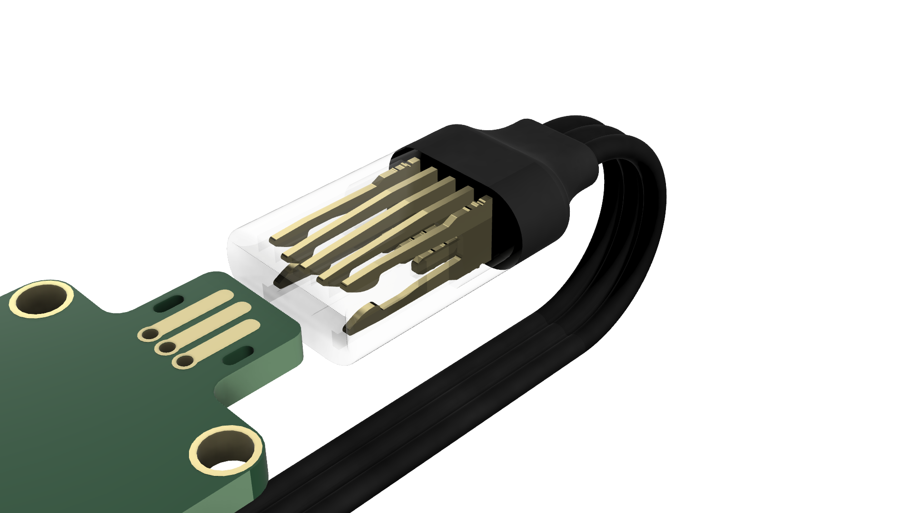
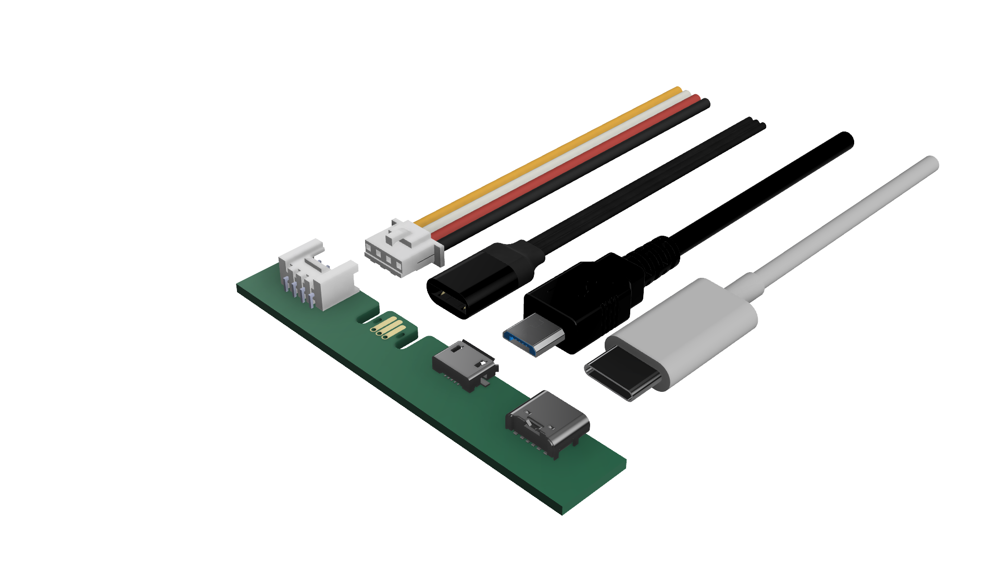

# Jacdac Connector

Jacdac uses 3-pin custom-designed connectors to quickly interface development boards with sensors, LCDs, relays and more.  

## The problem 

There are plenty of prototyping cables on the market. 
The issue is that there are also plenty of compromises that come with using them. 
They are fiddly, require high dexterity, and are easy to damage. 
We therefore decided to design a new cable connector and completely reimagine the plug-and-play experience. 

## The design process 

### Off-the-shelf connectors

We evaluated all the available options on the market, without finding anything able to tick all the boxes. 

### Enabling a cheaper modules ecosystem.

We decided to remove the need for any female port on the modules. This reduced assembly costs and time, but increased the technical challenge of making the new cable connector.

### Ideation stage

We explored several different approaches for plugging a cable connector directly onto a PCB. 

## The solution – Reversible, Haptic feedback, Compact design.  

The Jacdac Cable Connector is simple. 
Both orientations work, you can feel a “click” when it plugs in, and it feels so nice in your hand.  

### Reversible connector 

There's no need to worry about accidentally swapping the Power and Data wires on your breadboard. 
The Jacdac connector is engineered to be completely reversible, so you won't even have to think 
about the right orientation as you plug the cable. 

### Mechanical "click" feedback. 

Jacdac's state-of-the-art hook design delivers an impeccably fluid plug/unplug motion. 
Plugging the cable and experiencing a snap-fit feeling gives confidence that the connection has been made. 
This is achieved by two metallic hooks that snap into two slots on the board, 
always ensuring a robust link. 

### Compact. Ergonomic. 

The Jacdac cable has been engineered to match the needs of creators. 
Regardless being extremely compact (only 9.5x18.5mm), 
it provides an unprecedented experience in terms of comfort and ergonomic in its everyday use.
This makes connecting microcontrollers and peripherals as simple 
as plugging a USB device into your personal computer. 

## Engineered to give you the flexibility to do more.

The electrical pins and mechanical hooks have been tested extensively 
to ensure a consistent experience up to 1500 cycles.

### Three different sizes.

Jacdac cables come in different sizes to match the needs of the craziest projects. 

## Technical details

Technical details and schematics can be found in the [Jacdac Device Development Kit](https://github.com/microsoft/jacdac-ddk/tree/main/connector).

