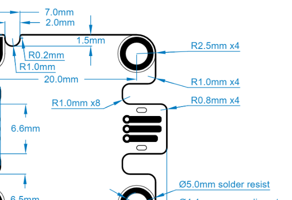

# EC30 Form Factor

To make it easier for users to recognize Jacdac devices, and for the devices to work with various electro-mechanical and mechanical accessories, we recommend the use of the [EC30 form factor](https://aka.ms/jacdac-ec30).
Among other benefits, this makes it easier to
build cheap enclosures for individual devices and to assemble groups of devices together to make an integrated product.

The EC30 rectangular form factor has one or more _Jacdac edge connectors_ on opposite sides of the PCB, four plated _mounting
holes_ that carry the Jacdac bus signals, and an _orientation notch_ indicating the upper-left of the board (viewed from the top side of the the PCB). There is always at least
one Jacdac edge connector on the left.

<DeviceSpecificationList
    sx={{ mb: 2 }}
    count={4}
    buyNow={true}
    ec30={true}
    connector={true}
    shapes={["ec30_2x2_lr", "ec30_3x2_lr"]}
/>

The details of the EC30 form factor are specified in the **[EC30 form factor](https://aka.ms/jacdac-ec30) specification**. Below we describe the key aspects of EC30. In addition to the sections below, make sure to read up on the [electrical](../electrical) and [electro-mechanical](../electro-mechanical) design guidelines.

## Benefits of EC30

One example benefit of EC30 devices is the use of [a breadboard](/devices/microsoft-research/jmbase86v41/) for easy prototyping. This allows various sizes of EC30-shaped devices to be mounted and connected without using cables, saving space and cost, and improving reliability. 

## Dimensions

The centers of the four mounting holes should be a multiple of 10.0mm apart in both x and y directions. The outline of the board extends 2.5mm from the holes to give a basic size that's 5.0mm wider and 5.0mm taller than the hole spacing. For a '20x20' module that has a hole spacing of 20.0mm in both x and y, the basic device size is 25.0 by 25.0mm. Note that Jacdac edge connector(s) extend by a further 1.5mm.

The smallest module is rectangular, with holes spaced 10.0mm in x and 20.0mm in y, with a single edge connector on the left-hand side. This leads to an overall size of 16.5 by 25.0mm. A small "square" EC30 module with edge connectors on both sides is 28.0mm in x by 25.0mm in y—see [here](https://aka.ms/jacdac-ec30-20x20).

Use our device outline generator to explore different options for module dimensions:

<EC30Editor />

## Edge connectors

Each [Jacdac edge connector](../electro-mechanical#pcb-edge-connector) is 6.6mm wide with clearance on each side to accommodate the cable connector and leave space for a "connector wall". There is always at least one edge connector on the left-hand side of the module, and if space permits there may be more. The vertical centre of all edge connectors must be on a 5.0mm grid, e.g. 10mm, 15mm, 20mm and so-on below the centre of the top-left mounting hole. 

If a Jacdac edge connector is not directly next to another, there should be exactly 2.7mm clearance between the edge of the connector and the adjacent PCB edge; if  connectors next to each other they should be on a 10.0mm spacing, leaving 3.4mm between them.

Edge connectors must only appear on the left- and right-hand sides of a device, not along the top and bottom edges.

Edge connectors are named starting with EC1, which is the top-most and left-most edge connector. Any additional connectors are named left-to-right and then top-to-bottom. 

## Other connectors

Some devices may require connectors other than Jacdac - for example a USB connector or 3.5mm audio connector. These should be placed on the left- or right-hand edges of the device, and where possible should overhang the PCB edge by 1.5mm.

## Status LEDs

EC30 Jacdac devices should have at least one status LED indicating [module and bus status](/reference/led-status/).
This can be a single color **orange** LED or a three-color **RGB** LED. The status LED may be disabled by the user to reduce current consumption. RGB LEDs may also put into a mode where the color is controlled by the user.

There should be at least one status LED **on each side of the device** that has edge connectors. The position of the LEDs is in the [Jacdac EC30 specification](https://aka.ms/jacdac-ec30).

## Mounting holes

The four plated-through mounting holes are named and connected as follows:

-   **MH1** is at the _upper-left_ corner of the board and is connected to _JD_DATA_, with the orientation notch immediately to its right;
-   **MH2** is at the _upper-right_ corner of the board and is connected to _GND_;
-   **MH3** is at the _bottom-left_ corner of the board and is connected to _JD_PWR_; and
-   **MH4** is at the _bottom-right_ corner of the board and is connected to _GND_.

Mounting holes have a finished (plated) diameter of 3.1mm, with a 4.4mm diameter annular copper ring, and a solder resist keepout of 5.0mm diameter. 

The mounting holes must be on 10mm pitch. This allows the modules to be mounted on a pre-drilled/perforated plate that has holes every 10mm in each direction.

## Component numbering and orientation

If the device contains multiple instances of a particular type of component—such as a matrix of key switches—they should generally be numbered from left-to-right and then from top-to-bottom, starting with 0 at the top left (i.e. next to MH1). A 3x4 matrix of key switches would have switch 0 at the top left, with switches 1 and 2 next to it and switches 3, 6 and 9 vertically underneath it. 

A 'ring' of components—such as 10 RGB LEDs—is numbered slightly differently: this starts with LED0 at the very top, and then counts up following the ring in a clockwise direction. 

If the orientation of a component is important, for example a screen or an accelerometer, that component should be exposed through software such that the x axis runs from left-to-right, the y axis runs from top-to-bottom, and the z axis runs out of the top of the PCB.

## Keepouts

Because the mounting holes and Jacdac edge connectors are electrically connected, it is important to define keepouts for other routing.
In particular, each mounting hole has a 6.0mm diameter keepout, while each edge connector has a rectangular keepout. No copper (except
for the mounting hole net) can be in the mounting hole keepout areas to prevent shorts when mounting.

The component placement keepout provides clearance for mounting bushes, connector wall, and other mounting features.

## Silkscreen marking

The name of a device and its manufacturer should be printed on the top surface of the PCB so that when oriented to read it, MH1 is in the top-left. One option is to print this information in the horizontal component keepout bands along the top and bottom edges of the device. 

All devices must also include a printed version number, perhaps on the underside of the PCB. In this way users can uniquely identify a device visually, based on the manufacturer name, device name, and version number.

All text should be at least 1.0mm high.

## QR code

We recommend that a QR code is printed on the device, perhaps on the underside. This QR code should resolve to the correct entry in the [Jacdac device catalog](https://microsoft.github.io/jacdac-docs/devices/). In this way, users can easily get information about any particular module. 

To ease the generation of suitable QR codes, we provide a [QR code generator](https://microsoft.github.io/jacdac-docs/tools/device-qr-code/) for popular electronics CAD packages such as Altium Designer, Eagle and KiCad.

## Component layout considerations

We recommend that the ESD diodes that protect JD_DATA and JD_PWR are placed between the Jacdac edge connector and the two mounting holes that carry those signals so they are close to both and provide protection before those nets move further on to the PCB.

If there are multiple Jacdac edge connectors, especially at opposite ends of the device, we recommend the use of multiple pairs of ESD diodes.

