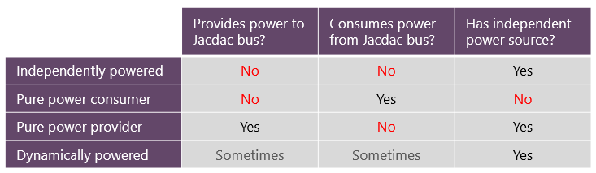
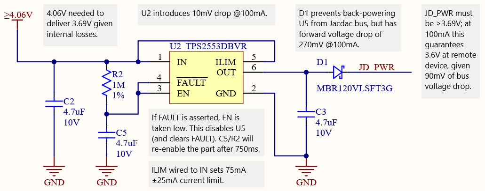

# Electrical

## Signalling

Jacdac data transmission occurs on a single wire (JD_DATA) using a half duplex asynchronous serial protocol called 
[single wire serial](/reference/single-wire-serial/) (SWS).  Data bytes are 10 bits long and are composed 
of 1 start bit, 8 data bits, and 1 stop bit. Jacdac devices must only communicate at 1 Mbaud 
and when no data is being transmitted, the bus must read as a logical one. Many MCU UARTs support 
single-wire half duplex communications,  but if necessary the UART transmit and receive pins can be 
connected together externally. The native Jacdac SWS signal uses 3.3V logic where a logical one 
is nominally 3.3V and a logical zero is nominally 0V.

To interface a microcontroller to the Jacdac bus data signal (JD_DATA) use the following circuit:

In the above schematic, the ESD diodes protect against potential static discharges directly onto the 
Jacdac PCB edge connector. Many alternative ESD didoes are suitable but we require ultra-low capacitance. 
The low-pass filter formed by FB1, C1 and R1 reduces unwanted electromagnetic emissions. R1 also limits 
JD_DATA current, and D1 products the microcontroller in case of unexpected voltages on the bus.

Note that when power is shared over the Jacdac bus, current flowing between devices will result in voltage drops. 
The current is limited to 1A but there may be several potentially long cables between a power provider and a 
power consumer resulting in an end-to-end resistance of several hundred mΩ and hence a voltage drop of several 
hundred mV in each direction (i.e. both on JD_PWR and on the GND return path).

## Power supply sharing

In addition to providing data communications, Jacdac supports the sharing of power between devices.

### Power supply sharing options

From a power perspective, Jacdac devices fall into one of four catgeories.

-   **Independently powered:** A device that communicates on the Jacdac bus without providing power 
or consuming power. It must have a bus independent power source of some kind—e.g. a battery or a 
USB-micro socket for external power—from which it operates.  
-   **Pure power provider:** A pure power provider is a device that is capable of supplying power to 
the Jacdac bus. The current available to the bus must be limited by circuitry in the power provider, 
and power providers capable of supplying more than 100mA must contain an MCU that implements the 
Jacdac [power provider service](/services/power/).
-   **Pure power consumer:** A power consumer always draws power from the Jacdac bus; the bus is 
its only power source. Due to power 
provision tolerance, a single module should draw no more than 900mA. If a device sometimes or always 
requires more than this it must be implemented as a power independent device or as a power provider.
-   **Dynamically powered device:** Some Jacdac devices may be able to operate as either a power consumer, 
power independent device and/or power provider. For example, a device with a bus independent power source 
may use that power source when it’s available but switch to using the Jacdac bus as a power source otherwise. 
We refer to these as dynamically powered Jacdac devices.

### Overview of Jacdac power sharing

The simplest Jacdac scenario involves a single power provider device connected directly to a pure power consumer device. 
An example is a [MakeCode Arcade gaming device](https://arcade.makecode.com/hardware) (provider) connected to a Jacdac temperature sensor (consumer). 
The power provider will continuously deliver power to the Jacdac bus, and when the power consumer is connected it will power up 
and start signalling its presence. Any number of additional pure power consumers and/or power independent devices may be 
connected to the bus, as long as the power provider can deliver enough current to operate them all.

In order to provide a certain level of safety, the power available on the bus is limited. This means that all power providers 
(including dynamically powered devices) must limit the current they deliver to the bus. The side-effect of this current limiting 
means that if the aggregate load of power consumers on the bus cannot be met, the bus voltage will fall and device operation will 
become unreliable. The [power provider service](/services/power) includes provisions for user feedback to make this condition 
easy to detect, understand and debug.

There are two types of power providers:

-   **Low current power providers** may supply up to [Iout(lc)](/reference/electrical-spec/#power-providers). This may either be on a single PCB edge connector 
or shared across several PCB edge connectors.
-   **High current power providers** may supply up to [Iout(hc)](/reference/electrical-spec/#power-providers). High current hub providers may supply up to [Iout(hc)](/reference/electrical-spec/#power-providers) per 
Jacdac PCB edge connector. High current Jacdac power providers must contain an MCU that implements the Jacdac [power provider service](/services/power) 
which ensures that only one such provider is active at any one time. This limits the current available on any one part of the Jacdac bus to [Iout(hc)](/reference/electrical-spec/#power-providers).

By default, Jacdac power providers are active (i.e. actively providing power) when they are first connected. 
This ensures that power is successfully delivered to pure power consumers. The Jacdac [power provider service](/services/power) 
will quickly detect if more than one high current provider is active at the same time and will cause one to be disabled; 
most likely it will move into power independent operation but it could instead become a power consumer.

### Power provider current limiting

As mentioned above, power providers **must** incorporate current limiting. We recommend the use of one of the 
many readily-available low-cost single-chip current limiters that operate at up to 5.5V.

Current limiters specify a tolerance on their output current - please ensure that the **maximum** output current does not exceed [Iout(lc)](/reference/electrical-spec/#power-providers) or [Iout(hc)](/reference/electrical-spec/#power-providers) (for low current and high current providers respectively). This often means setting the typical current to a value like 100mA or 900mA, which might result in as little as 75mA or 800mA in some cases. But it is important that the **maximum** current specification is not exceeded.

It is possible for a high current provider to have a maximum current of any value between [Iout(lc)](/reference/electrical-spec/#power-providers) and [Iout(hc)](/reference/electrical-spec/#power-providers). For example, a battery pack that is only able to supply 500mA could be used with a 500mA maximum Jacdac power provider.

**Resettable polyfuses are not suitable** for current limiting because they have a relatively large 'on' resistance, a larger threshold current tolerance and do not switch on or off cleanly. This is very confusing for the user. Jacdac devices must use a silicon current limiter.

### Example power delivery circuit

Please refer to our list of [Jacdac suggested components](https://github.com/microsoft/jacdac-ddk/tree/main/electronics/generic/suggested-components) for suggested current limiter ICs.

### Delivering more than 1A

We cannot allow more than 1A on any one part of the Jacdac bus because **Jacdac cables are only rated up to 1A**. However, it is possible for power providers such as dedicated Jacdac power supplies to have multiple Jacdac connectors each of which separately provides up to 1A. These multiple-output high-current power supplies must run the [power negotiation protocol](/services/power/) independently for each connector. In this way, if a user connects multiple outputs together via a Jacdac hub, this will be detected and power delivery will automatically be reduced to at most 1A for that section of the Jacdac bus. 

It is possible to use a single MCU to run the power negotiation protocol for several independently-powered connectors, but it may be more convenient to use one cheap PADAUK MCU per connector. 

### Cable and connector losses

Jacdac requires cabling of at least 26AWG, resulting in a resistance of 160mΩ/m. In addition, the contact resistance in a Jacdac connector may be up to 30mΩ. Therefore cables have a total end-to-end resistance of (160L+60) mΩ where L is the cable length in m. For example, a 350mm single-hop cable will have up to 116mΩ resistance including contact resistance at both ends.

### Bus voltage range

The nominal 5V bus voltage and maximum 1A bus current limit allow commonly available USB power delivery parts to be used for Jacdac. In particular, 5V power adapters, 5V power packs, 5V current limiting ICs and 5V DC-DC converters are all commodity items. Note that high current providers do not have to provide [Iout(hc)](/reference/electrical-spec/#power-providers), it may for example be cheaper to implement a 500mA power provider.

Note that any current flowing through the Jacdac bus will result in a voltage drop between the points of power provision and consumption, and any ground return current will cause a similar voltage drop. At 1A and with a 350mm, 116mΩ cable, this results in a 116mV drop on JD_PWR between power provider and power consumer, and another 116mV 'rise' on the GND return path; the power consuming device sees 232mV less than is being provided at the source. Additional hubs and cables will further reduce the margin.

### Power consumers

A power consumer may draw a maximum of [Iin(max)](/reference/electrical-spec/#power-consumers) given that [Iout(hc)](/reference/electrical-spec/#power-providers) may not be available due to component tolerances.

To accommodate voltage drops, Jacdac devices must be capable of operating when the potential between JD_PWR and GND falls to [Vin(min)](/reference/electrical-spec/#power-consumers). Since we expect the logic of a Jacdac device to operate at 3.3V (or lower), a low dropout linear regulator is the cheapest and simplest way to regulate JD_PWR to power a device from the bus. Alternatively a DC-DC converter can be used for improved efficiency.

Although some kind of voltage regulation is necessary to ensure that JD_DATA signalling runs at 3.3V, devices may also use unregulated JD_PWR if desired. For example, it will typically be more efficient to power a servo motor or a strip of RGB LEDs directly from JD_PWR. This reduces the amount of current passing through the on-device voltage regulation circuit, which in turn reduces losses and may reduce cost. 

### Jacdac bus brown-outs

Sometimes the Jacdac bus voltage JD_PWR will inevitably brown-out below [Vin(min)](/reference/electrical-spec/#power-consumers). For example, if the bus is overloaded the power provider's current limiter will either reduce the bus voltage, or will switch it off completely before re-trying. This means that all power consumers must be designed to behave gracefully if they are not supplied with a high enough voltage to operate reliably. MCUs should have brown-out protection and peripherals should fail gracefully in the face of a brownout. 

---