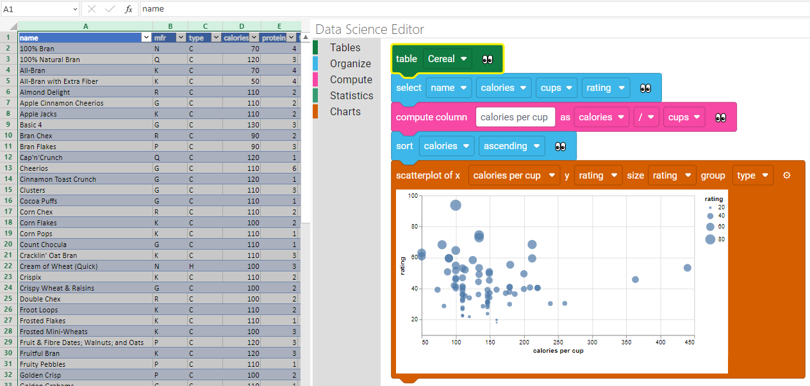
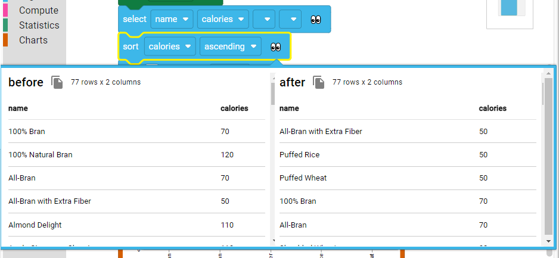

# About the Data Science Editor for Excel

The **Data Science Editor for Excel** is an experimental structured editor to create data analysis programs
in Excel Web.

## Getting started

-   In Excel Web, click **Get Addin** and search **Data Science Editor**, add this addin to your workspace.

-   Download the [Getting Started DataSet Sheet](https://microsoft.github.io/data-science-editor-excel/hosted_files/dataset.xslx) to get started with data

### "Data flows through blocks"

Each data blocks holds a dataset and acts as a transformation pipeline to the next block. The pipeline looks as follows:

-   a data block receives an updated dataset from its predecessor
-   (optionally) the data block transforms the dataset. For example, it can sort the data according to a column.
-   (optionally) update charts or tables
-   the data block pushes the data to its successors

### 👀 Data preview

The data blocks have a data preview button 👀 that allows to quickly glance at the dataset attached to the block. If a block also transforms the dataset, a before/after view is provided.

### Charts on the fly

Add charts as you transform the data.

### Discover transforms

Blocks are great to discover the vocabulary of a language. This also applies with data science.

### Loading and Saving projects

The blocks are automatically saved in the worksheet.
