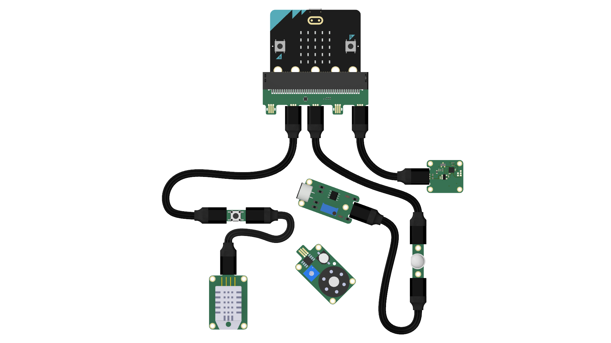

# Jacdac: plug-and-play for microcontrollers

**Jacdac** is a bus-based plug-and-play hardware and software stack for microcontrollers and their peripherals such as sensors and actuators. Jacdac is primarily designed for “modular electronics” scenarios that support rapid prototyping, creative exploration, making and learning through physical computing. Jacdac is designed to be cheap, flexible and extensible.

Jacdac includes:

* a purpose-built 3-wire cable and edge connector that supports data communication and power delivery;
* hot-plug device discovery;
* standardized service specifications;
* full stack support from 8-bit microcontoller firmware to web simulators and debuggers.

Try the **[dashboard](/dashboard/)** to simulate devices or visualize live data.

## Connector

Jacdac uses 3-pin custom-designed connectors to quickly interface development boards with sensors, LCDs, relays and more.  

* Learn more about the [Jacdac connector](/connector)
* Technical details and schematics in the [Jacdac Device Development Kit](https://github.com/microsoft/jacdac-ddk/tree/main/connector).

## Service specifications

Jacdac services are specified to abstract the hardware device from the software implementation.
The services are comprised of registers, commands and events, along with precise data layout information
for each packet.

* Browse the [service catalog](/services/)
* Learn more about [service specifications](/reference/service-specification/)

## Device catalog & firmware updates

The device catalog lists the registered Jacdac devices that can be automatically detected on the bus. 
The catalog information provides vendor information, the services supported by a device, 
firmware, and pictures. This information is also used to automtically detect, download and flash
firmware onto devices.

* Browse the [device catalog](/devices/)
* [Update](/tools/updater/) your firmware
* Learn more about [device definitions](/reference/device-definition/)

## Protocol overview

Jacdac devices communicate using *packets* over a *bus*, where each *device* can advertise itself 
and the set of *services* it provides. 
A *service* provides *registers*, *events* and *commands* to communicate with other devices.
Jacdac packets are sent serially among physical devices on the Jacdac bus
and may also be sent over WebUSB/WebBLE, 
providing connectivity to web-based tooling and services running in the web browser
(see the connect icon at the top of this page).

* Learn more about the [protocol specification](/reference/protocol/)

## Web-based simulators and tools

We've implemented Jacdac over **WebUSB**, which allows the Jacdac bus to reach into
the web browser without any driver or program installation. 

* use the [dashboard](/dashboard/) to display both physical and simulated devices
* explore our set of [tools](/tools/)

## Community

Jacdac is open source and 
most of the commmunication happens through our GitHub project.

* [start a discussion](https://github.com/microsoft/jacdac/discussions).
* [file an issue](https://github.com/microsoft/jacdac/issues).
* [GitHub repositories](/github/)
