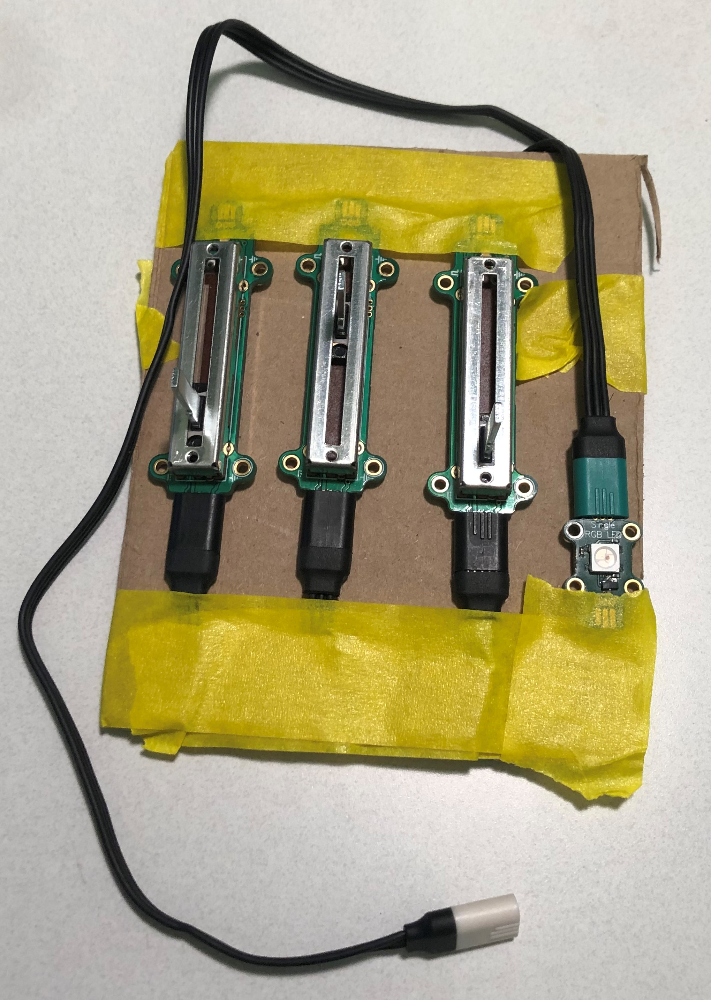

# Color Selector Module

The following pictures show the power of the plug-and-play paradigm
for microcontrollers.  Our scenario is to allow the 
end-user to create a RGB color.

For this scenario, we will use three [JM Slider v1.1](/devices/microsoft-research/jmslider49v11) 
modules, which implement the [potentiometer service](/services/potentiometer/), to adjust
the R, G, and B values and 
one [JM Single RGB LED v0.1](/devices/microsoft-research/jmsinglergbled42v01) module 
to display the resulting color.

Because Jacdac is a true bus, there are multiple ways to wire this composite module from
the atomic components. Our first version of the module uses a passive Jacdac hub as shown
below:

In the above network, the cable with the white end points provides the interface to the 
rest of the system (including the brain module, with the logic to compute the RGB color 
from the positions of the sliders, and set the RGB LED appropriately whenever the slider
positions change).  So we have a total of five cables for this module. 

To make the above network into a module, we use some cardboard and masking tape, 
with the hub taped on the backside:

Other wirings are possible, as shown in the linear arrangement below, which only
requires four cables:

It's important to note that no code changes are needed between the different
ways to wire up the color selector.
