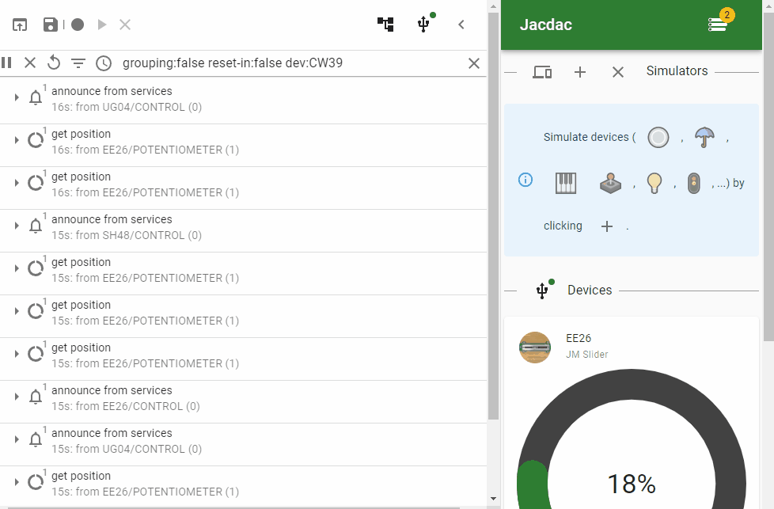
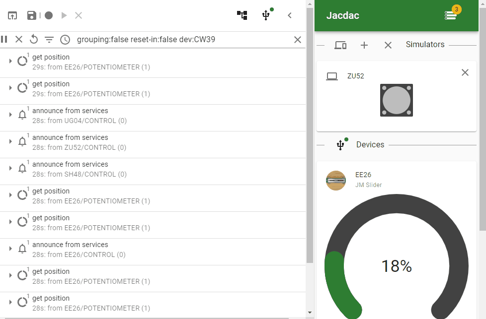

# Packet Console

The **packet console** provides a low-level log view over the packets being sent and received for the protocol.
This is an advanced view for a user trying to understand how the communication is hapenning (or not) in the protocol.

## Exploring packets

-   Open the [device tree](./device-tree) and click on the **history** icon to open the console
-   Use filters to narrow down which packet to see

## Pause and inspect

-   Use the play/pause button to stop updating packets
-   Click on any packet to see a detailled view of its contents

## Trace and replay

-   Click on the **Record trace** button to start recording a packet trace.
-   Once loaded, the web editor will be in "Trace mode" and only replay that trace
-   Clear the trace to resolve normal operations or click "Save" to share your trace.

