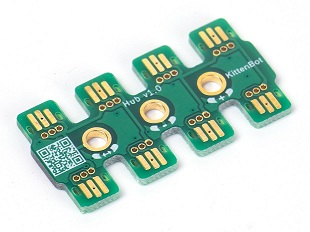

## Edge connector and hubs

Most Jacdac devices have at least one edge connector, which is the 
tab with three metal fingers that integrated into the device's printed circuit board (PCB). 
The PCB above is a Jacdac hub with eight Jacdac edge connectors, all connected together into
a single three-wire bus by traces on the PCB. The hub has no electrical 
components; its purpose is only to add more connection points to a Jacdac bus. The hub has no means
of computation or communication, unlike [brains](/start/brains) and [modules](/start/modules),
which have microcontroller units with a CPU and hardware for input and output.

## Double-sided

The edge connector is double sided, with connections (three fingers) on each 
side of the board, so no matter which way you connect a Jacdac cable to 
an edge connector, a stable electrical connection will be made.

## No edge connector? No problem!

For existing devices that have no Jacdac edge connector, [jacdaptors](/start/jacdaptors) 
provide a means of bridging such devices onto the Jacdac bus.
