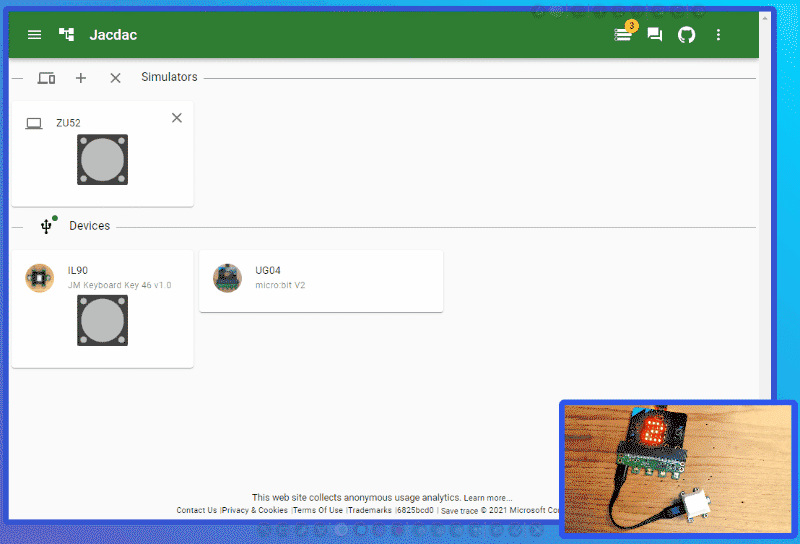

# Device Tree

The device tree is available at all times in the Jacdac web site. It allows to explore the Jacdac Object Model (JDOM) tree: devices -> services -> registers, events.

## Exploring devices

-   Click on the Tree icon on the upper left of the editor
-   Expand device and services until you see the registers you want to investigate.

## Identify services

-   Click on the device mini picture or icon to start the Identify sequence.

## Product Information

If the device is registered in the [device catalog](/devices), you will see a picture in the device tree.

-   Expand the device and click on the description to open the device page.

